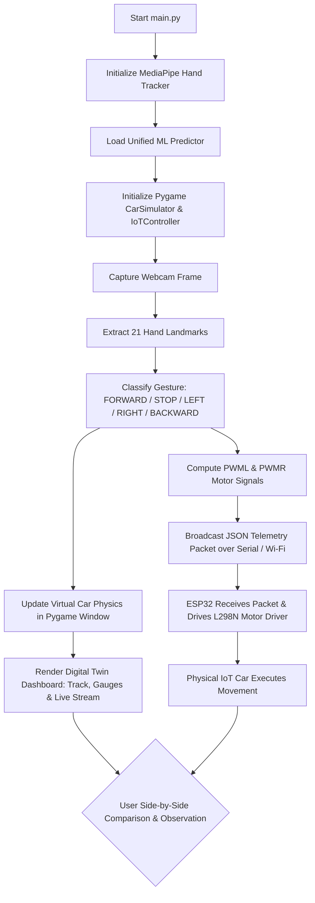

# Implementation Guide: ML-Based Computer Vision IoT Car & Virtual Simulator Integration

This document provides a comprehensive, step-by-step implementation plan for building, integrating, and deploying the **ML-Based Computer Vision IoT Car** alongside its **Virtual Car Simulator**. 

It translates the project vision from `Project Plan ML-Based Computer Vision IoT Car.pdf` into actionable hardware, software, machine learning, and IoT integration steps—highlighting how the virtual simulator acts as a real-time **Digital Twin** to compare virtual and physical car movements **without needing any separate ML model training**.

---

## 1. Executive Summary & Integrated Architecture

The system pairs **Edge AI Computer Vision** on a host PC/laptop with **dual simultaneous execution targets**: a 2D **Virtual Car Simulator** (Pygame-based) and a physical **IoT Edge Robotic Car** (ESP32-based).

> [!IMPORTANT]
> **Unified ML Model Architecture (No Separate ML Model Needed)**:
> The physical IoT car **does not require its own separate ML model or hardware-side vision training**. The exact same hand tracking and gesture classification pipeline ([hand_tracker.py](file:///d:/BragBoard-main/New%20folder/gesture_virtual_car/hand_tracker.py) and [gesture_predictor.py](file:///d:/BragBoard-main/New%20folder/gesture_virtual_car/gesture_predictor.py)) processes the webcam video feed once on the laptop and broadcasts real-time telemetry to **both** the virtual simulator and the physical ESP32 car simultaneously.

```
                                  +---------------------------------------+
                                  |     Vision Controller (Host Laptop)   |
                                  |   +-------------------------------+   |
                                  |   |   Webcam Video Capture        |   |
                                  |   +---------------+---------------+   |
                                  |                   |                   |
                                  |   +---------------v---------------+   |
                                  |   | MediaPipe 3D Hand Tracking    |   |
                                  |   +---------------+---------------+   |
                                  |                   |                   |
                                  |   +---------------v---------------+   |
                                  |   | Single Unified ML Classifier  |   |
                                  |   | (MediaPipe / Random Forest)   |   |
                                  |   +---------------+---------------+   |
                                  +-------------------|-------------------+
                                                      |
                         +----------------------------+----------------------------+
                         |                                                         |
                         v                                                         v
      +-----------------------------------+                     +-----------------------------------+
      |        VIRTUAL TARGET             |                     |          PHYSICAL IOT TARGET      |
      |  Pygame Virtual Car Simulator     |                     |    Physical ESP32 Robotic Car    |
      |  - 2D Physics & Track Rendering   |                     |    - ESP32 Microcontroller        |
      |  - Motor PWM Speed Gauges         |     JSON Packet     |    - L298N Motor Driver           |
      |  - Steering Compass Gauge         |====================>|    - 4x DC Gear Motors            |
      |  - Live Telemetry Monitor HUD     | (Serial / UDP Wi-Fi)|    - 7.4V Battery Power Pack      |
      |  (Real-Time Digital Twin View)    |                     |    (Executes Physical Movement)   |
      +-----------------------------------+                     +-----------------------------------+
```

---

## 2. Dual-Target Simulator & IoT Integration Architecture

### 2.1 How the Car Simulator Integrates with IoT Hardware
In this project, the simulator software ([simulator.py](file:///d:/BragBoard-main/New%20folder/gesture_virtual_car/simulator.py)) directly embeds the IoT hardware bridge ([iot_controller.py](file:///d:/BragBoard-main/New%20folder/gesture_virtual_car/iot_controller.py)):

1. **Frame Loop Synchronization**: Every frame (~60 FPS), [main.py](file:///d:/BragBoard-main/New%20folder/gesture_virtual_car/main.py) captures a webcam frame, runs `GesturePredictor`, updates `Car` physics, and calls `sim.render_frame()`.
2. **Automatic Telemetry Generation**: Inside `sim.draw_hud()`, the simulator automatically executes:
   ```python
   telemetry_pkt = self.iot.send_telemetry(speed_kmh, steer_angle_deg, state_str)
   ```
3. **Dual Action**:
   - **Virtual Render**: Calculates `pwml` and `pwmr` motor signals to update the HUD gauges, steering dial, and virtual car position on screen.
   - **Hardware Broadcast**: Formats the packet as JSON and writes it over Serial/Wi-Fi to the ESP32 microcontroller controlling the physical car.

### 2.2 Telemetry Packet Schema
The single JSON packet format sent to both the HUD monitor and ESP32 firmware:

```json
{
  "cmd": "DRIVE",
  "pwml": 180,
  "pwmr": 210,
  "steer": 12.5,
  "speed": 15.2,
  "state": "CONTROL",
  "ts": 84520
}
```

---

## 3. Virtual View Dashboard as a Live Telemetry "Digital Twin"

The virtual Pygame display functions as an interactive **Digital Twin Dashboard**, giving the user complete visibility into what the AI model is thinking and what commands are being transmitted to the physical car.

```
+-----------------------------------------------------------------------------------------------+
| IOT GESTURE CAR SIMULATOR                                                                     |
| MODE: GESTURE [MEDIAPIPE]              State: [ CONTROL ]    L-MOTOR: +180 PWM  [TELEMETRY]   |
| Keys: 'K'=Keyboard | 'M'=Model | 'R'=Reset | Delta: +12.5°      R-MOTOR: +210 PWM  {"cmd":"DRIVE"|
| IoT: PHYSICAL SERIAL: ON               Speed: 15.2 km/h      (Steer Dial)       "pwml":180..} |
+-----------------------------------------------------------------------------------------------+
|                                                                              |                |
|                                                                              |   [PICTURE-    |
|                             ( Virtual 2D Track )                             |    IN-PICTURE  |
|                                                                              |    WEBCAM FEED |
|                                   [VIRTUAL CAR]                              |    WITH HAND   |
|                                                                              |    LANDMARKS]  |
|                                                                              |                |
+-----------------------------------------------------------------------------------------------+
```

### Dashboard Elements & Diagnostic Functions:
1. **Picture-in-Picture Webcam Overlay**: Displays the live video feed with 21 hand landmarks drawn on top, verifying hand detection quality.
2. **State Badge (`CONTROL` / `STOP`)**: Visual color indicator (`Green` for active drive, `Red` for stop, `Blue` for keyboard mode).
3. **Differential Motor Gauges (`L-MOTOR` & `R-MOTOR`)**: Live bar graphs displaying exact PWM power values (`-255` to `+255`) sent to the left and right motor banks.
4. **Steering Compass Dial**: Superimposes the target gesture steering vector (red line) over the current virtual car orientation (green line).
5. **ESP32 Telemetry Monitor Box**: Live terminal widget showing the last 4 JSON packets transmitted to the ESP32.

---

## 4. Virtual vs. Physical Comparison & Validation Method

Using the Virtual View alongside the Physical IoT Car enables side-by-side performance benchmarking and validation:

| Comparison Metric | Virtual Car Simulator View | Physical IoT Robotic Car | Analysis & Tuning Purpose |
| :--- | :--- | :--- | :--- |
| **Input Source** | Single Webcam AI Gesture Pipeline | Single Webcam AI Gesture Pipeline | Ensures identical command input to both systems |
| **Response Latency** | Instantaneous (<16 ms frame render) | ~30 ms - 80 ms (Serial/Wi-Fi + Motor inertia) | Measures wireless/serial transmission & mechanical lag |
| **Steering Response** | Ideal kinematic differential drive math | Real wheels subject to tire friction & slip | Calibrates `steer_pwm_diff` multiplier in `IoTController` |
| **Motor Regulation** | Linear math calculation (`-255` to `+255`) | Affected by battery voltage drop & TT motor deadzones | Determines minimum PWM startup threshold (e.g., PWM $\ge 60$) |
| **Safety Fail-Safe** | Instantaneous software state reset | 500 ms ESP32 hardware Watchdog auto-stop | Validates physical safety in case of connection drop |

---

## 5. Requirements & Bill of Materials (BOM)

### 5.1 Hardware Components
| Subsystem | Component | Quantity | Notes / Specifications |
| :--- | :--- | :---: | :--- |
| **Controller** | Laptop/PC with Webcam | 1 | Runs Python 3.x, OpenCV, MediaPipe, Pygame, ML model |
| **Microcontroller** | ESP32 Development Board | 1 | NodeMCU ESP32-WROOM-32 (Wi-Fi & Bluetooth enabled) |
| **Motor Driver** | L298N Dual H-Bridge Driver | 1 | Controls motor direction & PWM speed (5V-35V) |
| **Motors** | DC Gear Motors | 4 | Yellow TT Motors (3V-6V), pre-wired |
| **Wheels** | Robot Wheels | 4 | Compatible with TT motor D-shafts |
| **Chassis** | 4WD Acrylic Robot Chassis | 1 | Double-deck chassis with standoff mounts |
| **Power Supply** | 18650 Li-ion Batteries | 2 | 3.7V each (~7.4V total) with dual slot battery holder |
| **Interconnects** | Jumper Wires | 1 Set | Female-to-Female & Male-to-Female jumper wires |

### 5.2 Codebase Architecture
* **Virtual Simulator Engine**:
  * [main.py](file:///d:/BragBoard-main/New%20folder/gesture_virtual_car/main.py): Main application entry point uniting AI, Pygame UI, and IoT stream.
  * [simulator.py](file:///d:/BragBoard-main/New%20folder/gesture_virtual_car/simulator.py): Pygame graphics dashboard and telemetry HUD renderer.
  * [car.py](file:///d:/BragBoard-main/New%20folder/gesture_virtual_car/car.py) & [physics.py](file:///d:/BragBoard-main/New%20folder/gesture_virtual_car/physics.py): 2D car kinematics and track collision physics.
* **AI & Vision Pipeline**:
  * [hand_tracker.py](file:///d:/BragBoard-main/New%20folder/gesture_virtual_car/hand_tracker.py): MediaPipe 3D hand landmark extractor.
  * [gesture_predictor.py](file:///d:/BragBoard-main/New%20folder/gesture_virtual_car/gesture_predictor.py): Real-time gesture classification engine.
* **IoT Hardware Interface & Firmware**:
  * [iot_controller.py](file:///d:/BragBoard-main/New%20folder/gesture_virtual_car/iot_controller.py): Differential PWM conversion & JSON packet transmitter.
  * [iot_esp32_car_firmware.ino](file:///d:/BragBoard-main/New%20folder/gesture_virtual_car/iot_firmware/iot_esp32_car_firmware.ino): ESP32 firmware with motor control & 500ms safety watchdog.

---

## 6. Circuit Wiring & Hardware Assembly Guide

### 6.1 Electrical Block Diagram
```
+------------------------------------+
| 7.4V Battery Pack (2x 18650 Cells) |
+------------------+-----------------+
  | (+) Red wire     | (-) Black wire
  v                  v
+--------------------+---------------------------------------+
| L298N Motor Driver Module                                  |
| [12V]             [GND]                     [5V]           |
|   |                 | (Common GND)            |            |
|   |                 +---------------+         |            |
|   |                 v               |         |            |
|   |          +--------------+       |         |            |
|   |          | ESP32 Board  |       |         |            |
|   +----------| VIN   GND    |<------+---------+            |
|              +-------+------+ (Powers ESP32 logic)        |
|                      | GPIO Pins                           |
|                      +=========> [ENA, IN1..IN4, ENB]      |
|                                    (Logic / PWM Control)   |
| [OUT1 & OUT2]                            [OUT3 & OUT4]     |
+------|-----|-----------------------------------|-----|-----+
       |     |                                   |     |
       v     v                                   v     v
 +---------------+                         +---------------+
 |  Left Motors  |                         | Right Motors  |
 |  (Parallel)   |                         |  (Parallel)   |
 +---------------+                         +---------------+
```

### 6.2 Pin Mapping Table
| Source Component & Pin | Target Component & Pin | Description / Purpose |
| :--- | :--- | :--- |
| **Battery Holder (+ Red)** | **L298N 12V Screw Terminal** | Motor Power Supply (+7.4V DC) |
| **Battery Holder (- Black)**| **L298N GND Screw Terminal** | System Power Ground |
| **L298N 5V Screw Terminal** | **ESP32 VIN Pin (or 5V)** | Powering ESP32 (requires 5V jumper ON) |
| **L298N GND Terminal** | **ESP32 GND Pin** | **CRITICAL: Shared Common Ground** |
| **ESP32 GPIO 14** | **L298N ENA** | Left Motors Speed PWM Control |
| **ESP32 GPIO 27** | **L298N IN1** | Left Motors Direction Signal 1 |
| **ESP32 GPIO 26** | **L298N IN2** | Left Motors Direction Signal 2 |
| **ESP32 GPIO 25** | **L298N IN3** | Right Motors Direction Signal 1 |
| **ESP32 GPIO 33** | **L298N IN4** | Right Motors Direction Signal 2 |
| **ESP32 GPIO 32** | **L298N ENB** | Right Motors Speed PWM Control |
| **L298N OUT1 & OUT2** | **Left Motors (Front + Rear)** | Parallel connection for Left wheels |
| **L298N OUT3 & OUT4** | **Right Motors (Front + Rear)**| Parallel connection for Right wheels |

> [!IMPORTANT]
> **Common Ground Requirement**: You MUST connect the GND screw terminal of the L298N driver directly to a GND pin on the ESP32. Without a shared ground reference, logic signals will fluctuate, causing erratic motor behavior or communication failure.

---

## 7. Step-by-Step Stepwise Execution Steps



### Step 1: Hardware Assembly & ESP32 Flashing
1. Assemble the 4WD chassis and complete circuit connections per Section 6.2.
2. Open [iot_esp32_car_firmware.ino](file:///d:/BragBoard-main/New%20folder/gesture_virtual_car/iot_firmware/iot_esp32_car_firmware.ino) in Arduino IDE or VS Code PlatformIO.
3. Select board `ESP32 Dev Module` and flash the code. Connect ESP32 to laptop via USB or configure Wi-Fi credentials.

### Step 2: Launch Integrated Simulator & IoT Bridge
1. Run [main.py](file:///d:/BragBoard-main/New%20folder/gesture_virtual_car/main.py):
   ```bash
   python main.py
   ```
2. The Pygame window will launch, initializing the single ML vision pipeline and opening the webcam feed.

### Step 3: Digital Twin Operation & Gesture Testing
1. Perform hand gestures in front of the webcam:
   - **Open Palm / Pointing (Left Hand)**: Virtual car drives forward, physical car motors spin forward (`PWML > 0, PWMR > 0`).
   - **Open Palm / Pointing (Right Hand in Left=Forward/Right=Reverse Mode)**: Virtual car drives in reverse, physical ESP32 car motors spin in the **opposite direction** (`PWML < 0, PWMR < 0`).
   - **Closed Fist**: Virtual car brakes, ESP32 cuts motor power (`STOP`).
   - **Thumb/Hand Left / Right**: Virtual car turns on screen, physical car executes differential rotation (`PWMR > PWML` or `PWML > PWMR`).
2. Keyboard Controls & Mode Toggles:
   - Press `'H'` to toggle **Hand Drive Option**:
     - `ALL_HANDS_FORWARD`: Both hands drive forward.
     - `LEFT_FORWARD_RIGHT_REVERSE`: Left Hand drives Forward; Right Hand drives in Reverse (spinning actual 4 wheels in opposite direction via H-Bridge motor drivers).
   - Press `'M'` to toggle between MediaPipe pre-trained neural net and custom ML models.
   - Press `'K'` to toggle Keyboard Mode.
   - Press `'R'` to reset car position.

---

## 8. Conclusion

By integrating the **Pygame Virtual Car Simulator** with the **Physical ESP32 IoT Car** under a **single unified AI vision pipeline**, this architecture eliminates redundant ML model training. The virtual simulator serves as a live **Digital Twin**, permitting real-time visual telemetry monitoring and side-by-side motion comparison between software physics and hardware execution.
